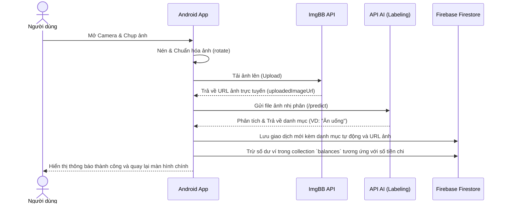

# Hướng dẫn & Tài liệu Mô tả Dự án: Quản lý Chi tiêu Cá nhân

Dự án **Quản lý Chi tiêu Cá nhân** là một ứng dụng di động chạy trên nền tảng Android (viết bằng ngôn ngữ **Java**), giúp người dùng dễ dàng theo dõi các khoản chi tiêu hàng ngày thông qua việc nhập tay thủ công hoặc chụp ảnh hóa đơn/sản phẩm để hệ thống tự động phân loại bằng mô hình học máy (Machine Learning). Dữ liệu được đồng bộ trực tuyến thời gian thực với **Firebase**.

---

## 📌 Các Tính Năng Chính
1. **Đăng nhập & Đăng ký tài khoản**: Xác thực người dùng qua **Firebase Authentication**. Mỗi người dùng có một không gian lưu trữ dữ liệu chi tiêu riêng biệt.
2. **Quản lý số dư**: Tự động trừ số dư tài khoản khi có giao dịch chi tiêu mới và cộng số dư khi nạp tiền.
3. **Thêm giao dịch thủ công**: Người dùng nhập tiêu đề, số tiền, ngày tháng, chọn ảnh từ thư viện (gallery) và chọn danh mục chi tiêu qua các Chip (Ăn uống, Di chuyển, Mua sắm, v.v.).
4. **Chụp ảnh & Phân loại tự động bằng AI**:
   * Chụp ảnh hóa đơn hoặc sản phẩm trực tiếp từ camera.
   * Tải ảnh lên cloud thông qua API **ImgBB** để lấy URL ảnh trực tuyến.
   * Gửi ảnh đến **API Labeling** (chạy local hoặc server riêng) để phân tích hình ảnh và trả về danh mục chi tiêu tự động (như: Ăn uống, Giải trí, Mua sắm...).
5. **Lịch sử giao dịch & Thống kê**:
   * Xem danh sách tất cả các giao dịch đã thực hiện sắp xếp theo thời gian.
   * Xem chi tiết từng giao dịch bao gồm tiêu đề, số tiền, danh mục, thời gian và hình ảnh hóa đơn đi kèm.
   * Giao diện Dashboard thống kê trực quan.

---

## 🛠️ Công Nghệ Sử Dụng
* **Platform**: Android SDK (Min SDK 24, Target SDK 35).
* **Language**: Java 11.
* **Build System**: Gradle with Kotlin DSL (`build.gradle.kts`).
* **Database & Auth**: 
  * **Firebase Auth**: Xác thực người dùng.
  * **Firebase Firestore**: Cơ sở dữ liệu tài liệu dạng NoSQL lưu trữ giao dịch và số dư.
* **Networking**: **Retrofit 2** & **OkHttp 3** để giao tiếp với các API bên ngoài.
* **Image Processing**:
  * **Glide**: Tải và hiển thị hình ảnh từ URL mượt mà.
  * **ExifInterface**: Xử lý xoay chiều hình ảnh chụp từ camera.
* **External APIs**:
  * **ImgBB API**: Lưu trữ hình ảnh hóa đơn/giao dịch trực tuyến.
  * **Labeling/AI API**: Mô hình phân loại ảnh chạy trên Backend (Python/FastAPI) trả về nhãn chi tiêu thích hợp.

---

## 📂 Cấu Trúc Thư Mục Source Code

Tất cả mã nguồn Java nằm trong package `com.example.app_quan_li_chi_tieu_ca_nhan`:

```text
com.example.app_quan_li_chi_tieu_ca_nhan/
│
├── api/                             # Cấu hình API và Retrofit Client
│   ├── ImgBBApi.java                # Interface gọi API upload ảnh lên ImgBB
│   ├── ImgBBResponse.java           # Model ánh xạ kết quả trả về từ ImgBB
│   ├── LabelApi.java                # Interface gọi API phân loại ảnh (Machine Learning)
│   ├── LabelResponse.java           # Model chứa nhãn (category) dự đoán từ API AI
│   └── RetrofitClient.java          # Cấu hình Retrofit cho ImgBB và Local API
│
├── models/                          # Các lớp đối tượng (Data Models)
│   ├── User.java                    # Thông tin người dùng
│   ├── Transaction.java             # Chi tiết một giao dịch (thu/chi)
│   ├── Balance.java                 # Quản lý số dư của người dùng
│   └── ServiceItem.java             # Các dịch vụ/chức năng bổ sung
│
├── adapters/                        # Các bộ chuyển đổi dữ liệu cho ListView/RecyclerView
│   ├── TransactionAdapter.java      # Hiển thị danh sách lịch sử giao dịch
│   └── ServiceAdapter.java          # Hiển thị danh sách dịch vụ tại màn hình chính
│
├── utils/                           # Các lớp tiện ích
│   └── CurrencyUtils.java           # Định dạng hiển thị tiền tệ (VND)
│
├── MainActivity.java                # Màn hình chính quản lý Bottom Navigation & Tab fragments
├── LoginActivity.java               # Màn hình đăng nhập tài khoản Firebase
├── RegisterActivity.java            # Màn hình đăng ký tài khoản mới
├── AddActivity.java                 # Màn hình thêm giao dịch thủ công (Chọn ảnh + Nhập tay)
├── CaptureTransactionActivity.java  # Màn hình chụp ảnh và tự phân loại danh mục bằng AI
├── TopupActivity.java               # Màn hình nạp tiền vào tài khoản
├── TransactionDetailActivity.java   # Màn hình xem chi tiết một giao dịch đã tạo
├── DashboardFragment.java           # Fragment hiển thị báo cáo & thống kê chi tiêu
├── HomeCardFragment.java            # Fragment hiển thị thẻ/thông tin tài khoản
├── HomePaymentFragment.java         # Fragment chính của Tab Home (chứa số dư và các dịch vụ nhanh)
├── ProfileFragment.java             # Fragment quản lý thông tin cá nhân & đăng xuất
├── TransactionsFragment.java        # Fragment hiển thị lịch sử danh sách giao dịch
├── MyApplication.java               # Khởi tạo ứng dụng (Firebase, v.v.)
└── GenericFileProvider.java         # FileProvider dùng chia sẻ đường dẫn ảnh cho Camera
```

---

## 🗄️ Cấu Trúc Cơ Sở Dữ Liệu Firebase Firestore

Ứng dụng sử dụng Firestore để quản lý dữ liệu theo mô hình NoSQL với cấu trúc chính:

### 1. Collection `users`
Mỗi tài liệu tương ứng với một người dùng đã đăng ký thành công:
* **ID tài liệu**: `userId` (lấy từ Firebase Auth UID)
* **Các trường dữ liệu**:
  ```json
  {
    "userId": "String",
    "email": "String",
    "fullName": "String",
    "createdAt": "Timestamp"
  }
  ```

### 2. Collection `transactions`
Mỗi tài liệu đại diện cho một giao dịch thu/chi:
* **ID tài liệu**: Tự động sinh ngẫu nhiên.
* **Các trường dữ liệu**:
  ```json
  {
    "userId": "String",         // UID của người tạo giao dịch
    "title": "String",          // Tiêu đề giao dịch (VD: Ăn sáng, Mua áo thun...)
    "amount": "Double",         // Số tiền chi tiêu
    "categoryName": "String",   // Tên danh mục (VD: Ăn uống, Mua sắm, Di chuyển...)
    "imageUrl": "String",       // URL hình ảnh lưu trên ImgBB (nếu có)
    "timestamp": "Long",        // Thời gian giao dịch dạng Epoch Milliseconds
    "date": "String",           // Ngày giao dịch định dạng dd/MM/yyyy
    "isExpense": "Boolean"      // true: Chi tiêu (trừ tiền), false: Nạp tiền (cộng tiền)
  }
  ```

### 3. Collection `balances`
Quản lý ví và số dư của người dùng:
* **ID tài liệu**: `userId`
* **Các trường dữ liệu**:
  ```json
  {
    "userId": "String",
    "currentBalance": "Double", // Số dư hiện tại trong ví (VNĐ)
    "currency": "String",       // Mặc định "VND"
    "lastUpdated": "Long"       // Thời gian cập nhật cuối cùng
  }
  ```

---

## 🔄 Quy Trình Xử Lý Chi Tiêu Bằng AI (Chụp Ảnh)

Quy trình tự động hóa phân loại chi tiêu thông qua camera tại [CaptureTransactionActivity.java](file:///d:/WORKSPACE/androidApp/app_quan_li_chi_tieu_ca_nhan/app/src/main/java/com/example/app_quan_li_chi_tieu_ca_nhan/CaptureTransactionActivity.java):



---

## 🚀 Hướng Dẫn Cấu Hình và Phát Triển Tiếp

Để chạy và phát triển dự án này trên máy tính của bạn, hãy thực hiện theo các bước sau:

### 1. Đồng bộ và Cấu hình Firebase
* Đảm bảo file [google-services.json](file:///d:/WORKSPACE/androidApp/app_quan_li_chi_tieu_ca_nhan/app/google-services.json) được đặt đúng ở thư mục `/app`.
* Bật **Firebase Authentication** (phương thức Email/Password).
* Bật **Cloud Firestore Database** ở chế độ test hoặc production (thiết lập rule đọc/ghi phù hợp).

### 2. Cấu hình khóa API ImgBB
* Đăng ký tài khoản tại [ImgBB API](https://api.imgbb.com/) để lấy API Key miễn phí.
* Thay thế hằng số `IMGBB_API_KEY` trong các file [AddActivity.java](file:///d:/WORKSPACE/androidApp/app_quan_li_chi_tieu_ca_nhan/app/src/main/java/com/example/app_quan_li_chi_tieu_ca_nhan/AddActivity.java#L67) và [CaptureTransactionActivity.java](file:///d:/WORKSPACE/androidApp/app_quan_li_chi_tieu_ca_nhan/app/src/main/java/com/example/app_quan_li_chi_tieu_ca_nhan/CaptureTransactionActivity.java#L71).

### 3. Cấu hình API Phân loại học máy (AI Labeling)
* API dự đoán danh mục được thiết lập gọi tại [RetrofitClient.java](file:///d:/WORKSPACE/androidApp/app_quan_li_chi_tieu_ca_nhan/app/src/main/java/com/example/app_quan_li_chi_tieu_ca_nhan/api/RetrofitClient.java#L37).
* Mặc định là địa chỉ IP cục bộ `http://192.168.1.108:8000/`. Hãy đổi IP này thành địa chỉ máy tính đang chạy server Python của bạn hoặc đổi thành domain Ngrok/Hosting của bạn khi đưa ứng dụng lên chạy thực tế.
